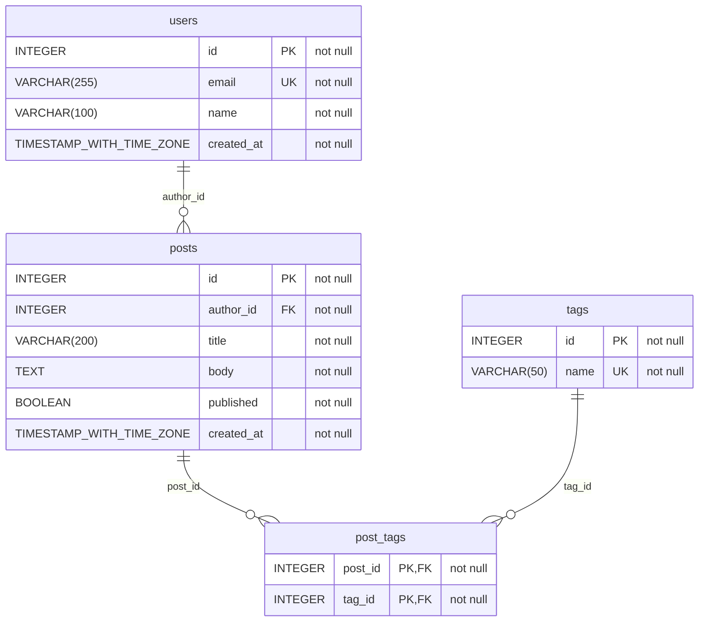

<!-- このファイルは自動生成されています。直接編集しないでください (DO NOT EDIT). -->
<!-- source: app/generated/db/models.py / regenerate: make generate -->

# ER 図

```mermaid
erDiagram
    post_tags {
        INTEGER post_id PK,FK "not null"
        INTEGER tag_id PK,FK "not null"
    }
    posts {
        INTEGER id PK "not null"
        INTEGER author_id FK "not null"
        VARCHAR(200) title "not null"
        TEXT body "not null"
        BOOLEAN published "not null"
        TIMESTAMP_WITH_TIME_ZONE created_at "not null"
    }
    tags {
        INTEGER id PK "not null"
        VARCHAR(50) name UK "not null"
    }
    users {
        INTEGER id PK "not null"
        VARCHAR(255) email UK "not null"
        VARCHAR(100) name "not null"
        TIMESTAMP_WITH_TIME_ZONE created_at "not null"
    }
    posts ||--o{ post_tags : "post_id"
    tags ||--o{ post_tags : "tag_id"
    users ||--o{ posts : "author_id"
```
